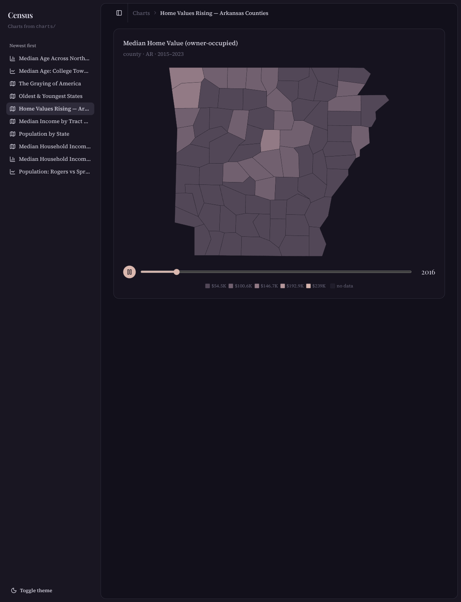

# Census Chart Dashboard

A SvelteKit dashboard that turns **U.S. Census data into charts and maps from plain TOML files**. Drop a file into `charts/` and it appears live — a toast announces it and it slides to the top of a newest-first sidebar, no restart.

All the Census ugliness (FIPS codes, variable codes, per-year fetches, geometry) is hidden behind the framework. A chart file only ever contains **friendly aliases and place names** — never a code.



## Features

- **TOML in, charts out.** One declarative file per chart; the framework resolves, fetches, caches, and renders it.
- **Live updates.** A file watcher + SSE stream means adding/editing/removing a `charts/*.toml` updates the UI instantly (toast on add, recompile on change, redirect on remove).
- **Five chart kinds** — `line`, `bar`, `area`, `scatter`, and `map` (choropleth). Single-year bars auto-render as a sorted horizontal ranking.
- **Maps at four levels** — state, county, place, and tract. National maps use an Albers USA projection (AK/HI insets); smaller extents use a fitted projection.
- **Animated choropleths.** Give a map a year _range_ and it plays through one frame per year with a play/pause button and a draggable scrubber, over a fixed color scale.
- **Offline, deterministic geo resolution.** Friendly place names → GEOIDs via bundled Census Gazetteer files; ambiguous names fail with a candidate list instead of charting the wrong place.
- **Immutable filesystem cache.** Census vintage data never changes, so responses are cached forever under `.cache/`.
- **An author CLI** for a tight write → validate → build loop.
- **Rosé Pine** theme, light/dark, with a theme-reactive color ramp so maps read correctly in both.

## Quick start

```sh
bun install
cp .env.example .env                  # then paste your Census API key
bun scripts/fetch-gazetteer.ts        # geography lookup data (one-time)
bun scripts/fetch-geometry.ts state   # map boundaries (one-time, per level)
bun scripts/fetch-geometry.ts county
bun run dev
```

A free Census API key is **required** — the data endpoints redirect anonymous requests to an HTML page. Grab one at <https://api.census.gov/data/key_signup.html>.

The gazetteer and geometry files are downloaded by the scripts (not committed). For place/tract maps, fetch the relevant state too, e.g. `bun scripts/fetch-geometry.ts place AR`.

## Authoring a chart

```toml
[chart]
title = "Population: Rogers vs Springdale, AR"
kind = "line"                 # line | bar | area | scatter

[query]
metric = "population"         # alias from registry/metrics.toml
dataset = "acs5"              # acs5 | acs1   (decennial deferred)
years = "2010..2023"          # range "a..b" OR a list [2010, 2015, 2020]

[[series]]
place = "Rogers, AR"          # friendly "Name, ST", resolved offline

[[series]]
place = "Springdale, AR"
```

`id` defaults to the filename slug. Each series `label` defaults to the resolved place name.

## Authoring a map (choropleth)

Maps shade many geographies by one metric:

```toml
[chart]
title = "Median Household Income by County, Arkansas"
kind = "map"

[query]
metric = "median_household_income"
dataset = "acs5"
year = 2023                   # a single year…

[map]
level = "county"             # state | county | place | tract
within = "AR"                # "US" | a state ("AR") | a county ("Benton County, AR")
```

**Animate it** by swapping the single `year` for a `years` range:

```toml
[query]
years = "2015..2023"          # …or a range → one frame per year, play/pause + scrub
```

Valid `level` × `within`: `state`+`US`; `county`+`US`/state; `place`+state; `tract`+county.

## CLI (`bun cli/census.ts <command>`)

| command             | what it does                                                        |
| ------------------- | ------------------------------------------------------------------- |
| `validate <file>`   | parse + resolve aliases/geographies + coverage checks               |
| `resolve "<place>"` | print the resolved GEOID + gazetteer details                        |
| `metrics`           | list registry aliases and the datasets each supports                |
| `build <file>`      | run the full pipeline, write tidy JSON to `.cache/charts/{id}.json` |
| `new <slug>`        | scaffold a skeleton TOML in `charts/`                               |

Ambiguous or unknown place names fail validation with a candidate list rather than charting the wrong place.

## How it works

```
charts/                 watched TOML chart specs (the content)
registry/metrics.toml   curated alias -> Census variable code, per dataset
registry/gazetteer/     Census Gazetteer flat files (offline place/county geo)*
registry/geometry/      TIGER boundary TopoJSON, keyed by GEOID, for maps*
src/lib/census/         schema · registry · geography · geometry · client · compile · types
src/lib/components/      ChartView (series) + MapView (choropleth)
src/lib/server/          charts catalog + fs watcher
src/routes/              sidebar shell · chart pages · /api/charts (+ SSE stream)
cli/census.ts            author toolkit
scripts/                 fetch-gazetteer · fetch-geometry
                         (* downloaded by the scripts, git-ignored)
```

The pipeline: **parse** (zod) → **resolve** (alias → variable code, place → GEOID) → **fetch** (cached Census API calls) → **compile** (tidy data / joined geometry + a render-ready payload) → **render** (LayerChart).

## Quality

```sh
bun run check    # svelte-check (types)
bun run test     # vitest (schema / geography / compile units)
bun run lint     # prettier
```

## Tech

[Bun](https://bun.sh) · [SvelteKit](https://svelte.dev/docs/kit) + Svelte 5 runes · [Tailwind v4](https://tailwindcss.com) · [shadcn-svelte](https://shadcn-svelte.com) · [LayerChart](https://layerchart.com) · [d3-geo](https://github.com/d3/d3-geo) · [smol-toml](https://github.com/squirrelchat/smol-toml) · [zod](https://zod.dev). Geo data from the U.S. Census Bureau (Gazetteer + TIGER).

## License

MIT
